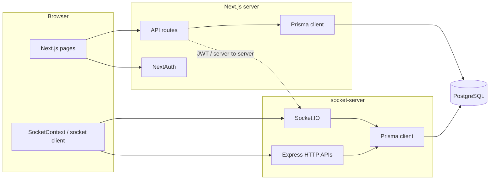

# Hoppr (BarHop)

Hoppr is a full-stack web app for planning bar crawls, browsing venues, buying VIP passes, and social features (map, hop-ins, notifications, and real-time chat). The repository root is **barhop**; the product name in the UI is **Hoppr**.

## Architecture overview

The system splits **long-lived WebSocket traffic** from the **Next.js** app:

- **Next.js 15 (App Router)** serves pages, marketing routes, authenticated app routes under `src/app/app/`, and **Route Handlers** under `src/app/api/` for REST-style APIs, sessions, and database access via Prisma.
- **socket-server** is a separate **Node + Express + Socket.IO** service. It shares the same PostgreSQL database (Prisma) and verifies clients with **JWT** issued by the Next app. It pushes real-time events (notifications, chat, crawl join flows, etc.) and exposes some HTTP endpoints (for example notification list and mark-read) that the browser calls with the same bearer token.



**Why two processes:** Vercel-style serverless is a poor fit for always-on Socket.IO. Running chat and notification delivery on a dedicated host (for example Render) keeps the Next deployment simple while still giving reliable real-time behavior.

## Repository structure

High-level layout (only the main areas):

```
barhop/
├── prisma/                    # Schema, migrations, seed script
│   ├── schema.prisma
│   ├── migrations/
│   └── seed.ts
├── socket-server/             # Standalone Socket.IO + Express API
│   ├── server.ts
│   ├── package.json
│   └── prisma/                # Schema copy / generate for this package
├── public/                    # Static assets, favicons, manifest
├── src/
│   ├── app/
│   │   ├── (marketing)/       # Public marketing pages (home, contact, partners, auth)
│   │   ├── app/               # Authenticated app shell + feature pages
│   │   │   ├── layout.tsx     # AppNavbar, SocketProvider, footer
│   │   │   ├── bars/
│   │   │   ├── chat/
│   │   │   ├── crawl-planner/
│   │   │   ├── crawls/
│   │   │   ├── social/
│   │   │   ├── vip-pass/
│   │   │   └── ...
│   │   ├── api/               # Next.js Route Handlers (REST)
│   │   ├── layout.tsx         # Root: fonts, StyledComponentsRegistry, AuthProvider
│   │   └── globals.css
│   ├── components/
│   │   ├── app/               # Feature UI (crawl, chat, bars, social, VIP, …)
│   │   └── marketing/         # Landing, navbar, footer, theme providers
│   ├── lib/                   # prisma, auth, theme, registry, socket helpers
│   └── types/                 # Shared TS types (e.g. socket payloads)
├── next.config.ts
├── package.json
└── vercel.json
```

### `src/app` routing

| Area | Purpose |
|------|---------|
| `(marketing)/` | Public site: home, contact, partners, marketing auth entry points. |
| `app/` | Logged-in experience: crawl planner, dashboards, bar details, VIP checkout and wallet, social map, notifications, settings, chat (crawl and private rooms). |
| `api/` | JSON APIs for crawls, bars, cities, chat, VIP purchase, social hop-in, NextAuth, JWT for sockets, etc. |

### `src/components`

- **`components/app/`** — Application UI grouped by feature (`crawl/`, `chat/`, `bars/`, `social/`, `vip-pass/`, `contexts/` for `SocketProvider`, shared `app-navbar/`, auth forms).
- **`components/marketing/`** — Public pages, shared `Providers` (session + theme), navigation and footer.

### `src/lib`

- **`prisma.ts`** — Singleton Prisma client for the Next server.
- **`auth.ts`** — NextAuth options (credentials + Google, Prisma adapter, JWT sessions).
- **`socket.ts`** — Client-side Socket.IO singleton and typed emit helpers used outside the main provider where needed.

### Data layer (`prisma/`)

`schema.prisma` models users (NextAuth tables), cities, bars, crawls and participants, VIP passes, groups, chat rooms and messages, social profiles and meetups, notifications, hop-ins, and related entities. Migrations live under `prisma/migrations/`.

## Tech stack

- **Framework:** Next.js 15 (App Router), React 19, TypeScript  
- **Styling:** styled-components, global CSS  
- **Auth:** NextAuth.js v4, Prisma adapter, JWT strategy  
- **Database:** PostgreSQL via Prisma  
- **Maps:** Leaflet / react-leaflet  
- **Real-time:** socket.io-client (browser) + socket.io (socket-server)  
- **Deployment:** Vercel-oriented config for the web app; socket server intended for a long-running Node host  

## Local development

### Prerequisites

- Node.js 18+
- PostgreSQL (local or hosted, for example Neon)

### 1. Install and configure the web app

```bash
cd barhop
npm install
```

Create **`.env.local`** in the project root (this repo does not ship `.env.example`). Typical variables:

| Variable | Used by | Purpose |
|----------|---------|---------|
| `DATABASE_URL` | Next + Prisma | PostgreSQL connection string |
| `NEXTAUTH_URL` | NextAuth | Canonical site URL (e.g. `http://localhost:3000`) |
| `NEXTAUTH_SECRET` | NextAuth | Session encryption |
| `GOOGLE_CLIENT_ID` / `GOOGLE_CLIENT_SECRET` | NextAuth | Optional Google sign-in |
| `JWT_SECRET` | Next API + socket-server | Must match on both sides for socket auth and server-triggered emits |
| `SOCKET_SERVER_URL` | Next API routes | Base URL of the socket service when the Next server calls it (default `http://localhost:3001`) |
| `NEXT_PUBLIC_SOCKET_URL` | Browser | Socket.IO server URL |
| `NEXT_PUBLIC_BACKEND_URL` | Browser | HTTP base for socket-server REST (notifications, etc.); defaults differ in code for dev vs prod—set explicitly for clarity |

Apply schema and (optionally) seed:

```bash
npx prisma migrate dev
npm run db:seed
```

Run Next:

```bash
npm run dev
```

Open [http://localhost:3000](http://localhost:3000).

### 2. Run the socket server

In a **second terminal**:

```bash
cd socket-server
npm install
```

Set at least `DATABASE_URL`, `JWT_SECRET` (same as Next), and `PORT` (optional, default `3001`). Then:

```bash
npm run dev
```

Production-style build:

```bash
npm run build
npm start
```

Health check: `GET /health` on the socket server port.

## npm scripts (root)

| Script | Description |
|--------|-------------|
| `npm run dev` | Next.js development server |
| `npm run build` | `prisma generate` + `next build` |
| `npm run start` | Production Next server |
| `npm run db:push` | Push schema without migration files |
| `npm run db:studio` | Prisma Studio |
| `npm run db:seed` | Run `prisma/seed.ts` |
| `npm run db:reset` | Reset DB, reapply migrations, seed |

## Cross-origin behavior

The socket server validates browser origins (localhost, configured production hosts, and `*.vercel.app` previews). If you deploy new front-end URLs, update the allowlist in `socket-server/server.ts` to match your environment.

## License / contributing

Private project (`"private": true` in `package.json`). Adjust this section if you open-source the repo.
